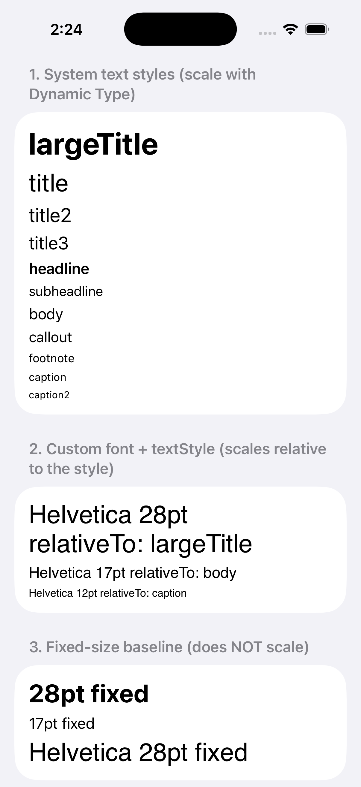
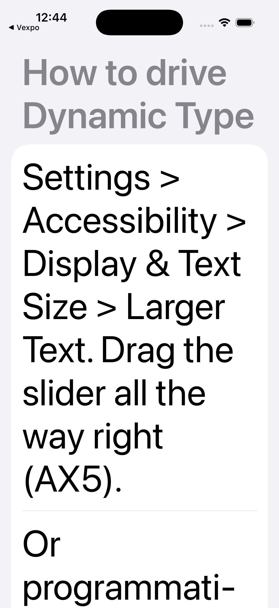

# expo-ui Dynamic Type font modifier iOS repro

Wanted text in an `@expo/ui` app to scale with iOS Dynamic Type and realized the `font` modifier resolves to fixed-size SwiftUI factories only. Filed [`expo/expo#46007`](https://github.com/expo/expo/pull/46007) to add a `textStyle` option that maps to `Font.system(_:design:)` and `Font.custom(_:size:relativeTo:)`, the SwiftUI-native path for [Apple's Larger Text Accessibility Nutrition Label](https://developer.apple.com/help/app-store-connect/manage-app-accessibility/larger-text-evaluation-criteria). This repo is the minimal repro so maintainers and reviewers don't have to spend time recreating one to validate the PR.

<table>
  <tr>
    <td></td>
    <td></td>
  </tr>
</table>

## Run

You need Xcode with an iOS simulator and Bun.

```bash
bun install
bun run prebuild
bun run ios
```

First build takes a few minutes while Xcode compiles the dev client and the patched `@expo/ui`. After that JS edits hot-reload through Metro.

## What's on the home screen

`App.tsx` renders four sections. Each one exercises a different branch of `FontModifier.resolveFont()`.

| # | Section | What to confirm |
|---|---|---|
| 1 | System text styles | 11 rows, one per iOS `Font.TextStyle` case. Drag iOS Larger Text to AX5 and every row scales. `largeTitle` to `caption2`, the full hierarchy. |
| 2 | Custom font + textStyle | `font({ family: 'Helvetica', size: N, textStyle: X })` maps to `Font.custom(_:size:relativeTo:)`. Helvetica rows scale relative to the named style. |
| 3 | Fixed-size baseline | `font({ size: N })` and `font({ family, size })` without `textStyle` hold their absolute size at every Dynamic Type setting. The contrast against sections 1 and 2 is what makes the demo readable. |
| 4 | Weight on custom family | Co-benefit fix. Pre-patch, `Font.custom(_:size:)` dropped `weight` silently. The same call now applies bold and heavy. |

## Verify the bug

Swap the patched build for the vanilla published version, reinstall, run typecheck.

```bash
sed -i.bak 's|"@expo/ui": "file:./expo-ui-56.0.9.tgz"|"@expo/ui": "56.0.9"|' package.json
rm -rf node_modules bun.lock
bun install
npx tsc --noEmit
```

14 `TS2353` errors, one per `textStyle` use site in `App.tsx`. The option does not exist on the published `@expo/ui@56.0.9` `font()` params type. Swap back to the patched tarball and `tsc` exits 0.

## Drive Dynamic Type from the CLI

```bash
xcrun simctl ui booted content_size accessibility-extra-extra-extra-large
xcrun simctl ui booted content_size large                                       # restore
```

## License

MIT.
